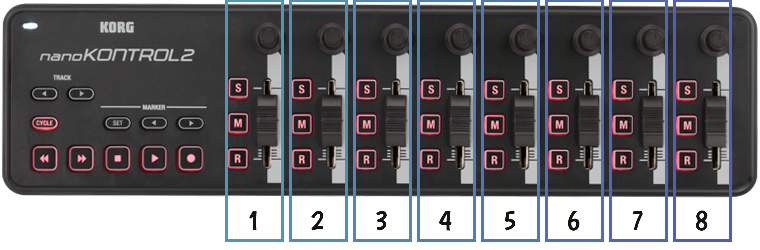

# korgnano

This is a library to read values from the Korg [NanoKontrol2](http://www.korg.com/us/products/controllers/nanokontrol2/), via MIDI. I'd eventually like to add support for the [NanoKey2](http://www.korg.com/us/products/controllers/nanokey2/), and maybe the [NanoPad2](http://www.korg.com/us/products/controllers/nanopad2/).

I made it for use with [Processing](http://processing.org), but it should be usable with any JVM program. It relies on no external libraries.

It's meant to be easy, and not a full-featured MIDI client.

## Project Status: Just Started

It's really, really simple right now. Closer to a working proof-of-concept than a real library.

## Usage

First, take a look at the Kontrol2:



You can read from the sliders, dials, and Solo, Mute, and Record buttons. The other buttons haven't been added yet.

The sliders and dials will always yield values between 0 and 127 inclusive.

The Solo, Mute, and Record buttons operate in moment mode, by default - press a button, and the Kontrol2 will report that it's "on," until you release the button. You can switch it to Toggle mode - press a button, and release it, the Kontrol2 will report that it's "on"; press and release it again, and the Kontrol2 will report that it's "off."

```java
import korgnano.*;

Kontrol2 k2;
void setup() {
  k2 = new Kontrol2();

  // The buttons all default to MOMENT mode - they're only "on" while you're
  // pressing them down. Let's set some to TOGGLE mode.
  k2.setRecordButtonMode(3, ButtonMode.TOGGLE);
  k2.setSoloButtonMode(8, ButtonMode.TOGGLE);
} 

void draw() {
  background(
    map(k2.slider(1), 0, 127, 0, 255),
    map(k2.slider(2), 0, 127, 0, 255),
    map(k2.dial(3), 0, 127, 0, 255));
  
  // If the eighth solo button ("S") is pressed, toggle between stroke & fill.
  // Note: it's 1-based, not 0-based.
  if (k2.solo(8)) {
    stroke(255);
    noFill();
  }
  else {
    noStroke();
    fill(255);
  }
  
  // If the seventh mute button ("M") is pressed, draw a circle.
  if (k2.mute(7)) {
    ellipse(width/2, height/2, 50, 50);
  }
  
  // If the third record button ("R") is pressed, toggle RGB & HSB.
  if (k2.record(3)) {
    colorMode(HSB);
  }
  else {
    colorMode(RGB);
  }
}

```

## `TODO`

* ~~Support momentary mode for the buttons.~~
* Get the LED lights working. I _think_ I need to send control messages back to the kontrol2, but I'm not sure. I'm still experimenting. I've [asked Korg for the details](https://twitter.com/danbernier/status/701535226707779585), maybe I'll get lucky.
* Support the track, cycle, playback, etc buttons.
* Maybe add configurable range mapping: instead of 0..127, maybe -1..1, or 0..100, or 0..1, or 0..360, or whatever.
* Support the NanoKey2, and maybe the NanoPad2.
* Add examples, javadoc, a downloadable .zip, a gh-pages branch, etc.
* Register with Processing.org.
